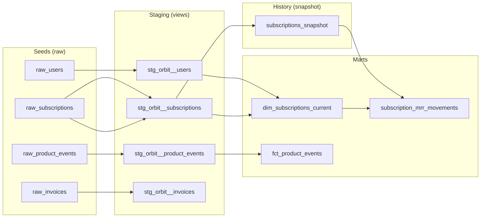

# Orbit — SaaS Subscription Analytics (dbt on Snowflake)


A dbt project modeling a fictional SaaS product (Orbit): users, subscriptions, product usage events, and invoices. Built as a step up from an earlier portfolio project ([wknd_analytics_dbt](https://github.com/bluelion1999/wknd_analytics_dbt), DuckDB + static seeds) into the parts of dbt that only make sense once your data actually changes between runs: snapshots, incremental models, unit tests, and model contracts, running against a real client-server warehouse (Snowflake) instead of an embedded one.

## Why this domain

Subscriptions mutate — `status` moves between `trial`/`active`/`past_due`/`canceled`, `plan_tier` gets upgraded or downgraded — and that mutation is exactly what a static, seed-once dataset can't demonstrate. `scripts/simulate_time_passing.py` writes directly to Snowflake (not through `dbt seed`, which can only replace a table wholesale) to mutate a handful of subscriptions and land a new batch of product events on demand, giving `dbt snapshot` and the incremental model something real to react to between runs.

## Architecture



**Layers:**
- **Seeds** — deterministic synthetic data (`scripts/generate_seed_data.py`, fixed random seed, fixed reference date) standing in for a raw source system.
- **Staging** — 1:1 cleanup of each source table, no joins.
- **Snapshot** — `subscriptions_snapshot` captures SCD Type 2 history over the mutable `raw_subscriptions` table using a timestamp strategy on `updated_at`.
- **Marts** — `dim_subscriptions_current` (current-state dimension), `fct_product_events` (incremental fact table), and `subscription_mrr_movements` (MRR movement classification computed directly off the snapshot's history).

## Advanced dbt features covered

- **Incremental models** — `fct_product_events` uses `materialized='incremental'`, a `merge` strategy keyed on `event_id`, and a high-water-mark filter on `event_timestamp`. Verified in practice: a second run with no new data produced `SUCCESS 0`; after simulating a new batch, the same run produced `SUCCESS 300` — exactly the new rows, not a full rebuild.
- **Snapshots (SCD Type 2)** — `subscriptions_snapshot` tracks every status/plan_tier change over time via `dbt_valid_from`/`dbt_valid_to`, giving `subscription_mrr_movements` real history to classify instead of a single current state.
- **Unit tests** — `subscription_mrr_movements`'s classification logic (new / reactivation / expansion / contraction / at_risk / churn) is covered by hand-written fixture-based unit tests, independent of whatever happens to be in the warehouse.
- **Model contracts** — `fct_product_events` and `dim_subscriptions_current` enforce a typed, fixed column contract, verified by deliberately breaking a column's declared type and confirming the build failed with a clear diff before reverting.
- **Custom generic test** — `reconciles_to_running_total` (`tests/generic/`) is a reusable reconciliation test asserting that a running sum of a delta column matches a balance column; applied to confirm `mrr_delta` always telescopes correctly to `current_mrr_amount`.
- **Source freshness** — `raw_subscriptions`/`raw_product_events` have `loaded_at_field` + `freshness` thresholds configured, and `dbt source freshness` correctly reported `STALE` against the static seed data and `PASS` once simulated data landed.

## Notable design decisions (and bugs caught along the way)

- **Churn has two paths, not one.** The MRR movement classification originally only treated `active → canceled` as churn. In practice, this dataset's only cancellation path is `past_due → canceled` (accounts almost always fail payment before they're canceled) — so the first version of the logic silently misclassified every real churn event as `'no_change'`. Both paths are now handled explicitly.
- **`trial → active` is `'new'`, not invisible.** A subscription's first-ever appearance in the snapshot gets `'new'` by definition (no previous state to compare against) — but a trial converting to its first paying period is *also* new business, and needed its own explicit rule rather than falling through to the catch-all.
- **`active → past_due` is `at_risk`, distinct from `churn`.** The subscription hasn't left yet; conflating the two would understate real churn and overstate risk.
- **Contracts + incremental models require an explicit `on_schema_change`.** dbt refuses `'ignore'` (the default) once a contract is enforced on an incremental model — `'fail'` was chosen here since the contract already owns schema control, so silent auto-altering (`'append_new_columns'`) would be redundant.
- **CI intentionally excludes seeds.** Unlike a DuckDB project where every CI run gets a fresh, ephemeral database, this project's Snowflake warehouse is persistent and carries real accumulated snapshot/incremental history from `simulate_time_passing.py`. Re-seeding on every push would silently reset that history, so CI runs `dbt build --exclude resource_type:seed` instead, treating the raw tables as already loaded by an upstream process — the seed scripts are for local/demo bootstrapping, not routine CI.

## Project structure

```
├── seeds/                            # Deterministic synthetic raw CSV data
├── scripts/
│   ├── generate_seed_data.py         # Reproducible initial dataset (fixed seed + reference date)
│   └── simulate_time_passing.py      # Mutates Snowflake directly: subscription changes + new events
├── snapshots/
│   └── subscriptions_snapshot.sql    # SCD2 history over raw_subscriptions
├── models/
│   ├── staging/orbit/                # 1:1 cleanup of raw sources + source freshness config
│   └── marts/
│       ├── core/                     # dim_subscriptions_current, fct_product_events (contracted)
│       └── reporting/                # subscription_mrr_movements + its unit tests
├── tests/generic/
│   └── test_reconciles_to_running_total.sql
├── dbt_project.yml
├── packages.yml                      # dbt_utils
├── profiles.yml                      # Snowflake connection (env_var-based, no secrets committed)
└── .github/workflows/dbt_ci.yml      # CI: dbt build against Snowflake on push/PR to main
```

## Getting started

```bash
git clone https://github.com/bluelion1999/SaaS_subscription_analytics_dbt.git
cd SaaS_subscription_analytics_dbt

python -m venv .venv
# Windows:
.venv\Scripts\activate
# macOS/Linux:
source .venv/bin/activate

pip install dbt-snowflake
dbt deps

# profiles.yml lives in the project root and reads credentials from env vars.
# Create a .env file (git-ignored) with:
#   SNOWFLAKE_ACCOUNT=your_account_identifier
#   SNOWFLAKE_USER=your_username
#   SNOWFLAKE_PASSWORD=your_password
# then export them into your shell, e.g. via a tool like direnv, or:
export $(cat .env | xargs)          # macOS/Linux
# PowerShell: Get-Content .env | ForEach-Object { if ($_ -match '(.+)=(.+)') { [Environment]::SetEnvironmentVariable($matches[1], $matches[2]) } }

export DBT_PROFILES_DIR=.

python scripts/generate_seed_data.py
dbt seed
dbt build                              # snapshot + models + tests, in dependency order

python scripts/simulate_time_passing.py   # simulate a tick of real-world change
dbt snapshot                              # capture the SCD2 history
dbt run --select fct_product_events       # verify incremental merge picks up only the new rows

dbt docs generate
dbt docs serve
```

## Tech stack

- [dbt-core](https://github.com/dbt-labs/dbt-core) 1.12 + [dbt-snowflake](https://github.com/dbt-labs/dbt-snowflake)
- [Snowflake](https://www.snowflake.com/) (dedicated warehouse/database/role for this project)
- [dbt_utils](https://github.com/dbt-labs/dbt-utils)
- Python 3.13 (seed generation and time-passing simulation — not a runtime dependency of the dbt project itself)
- GitHub Actions for CI
