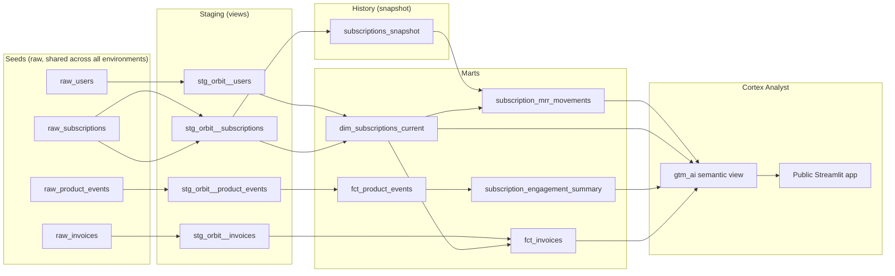

# Orbit — SaaS Subscription Analytics (dbt on Snowflake)


A dbt project modeling a fictional SaaS product (Orbit): users, subscriptions, product usage events, and invoices. Built as a step up from an earlier portfolio project ([wknd_analytics_dbt](https://github.com/bluelion1999/wknd_analytics_dbt), DuckDB + static seeds) into the parts of dbt that only make sense once your data actually changes between runs — snapshots, incremental models, unit tests, model contracts — plus a second phase covering environment separation, slim CI, and a public natural-language layer on top of the marts via Snowflake Cortex Analyst.

**Live demo:** ask it questions about subscription MRR movements — [GTM AI](https://saassubscriptionanalyticsdbt-dh7pogzyu4qmdjxa9wtzas.streamlit.app/)

## Why this domain

Subscriptions mutate — `status` moves between `trial`/`active`/`past_due`/`canceled`, `plan_tier` gets upgraded or downgraded — and that mutation is exactly what a static, seed-once dataset can't demonstrate. `scripts/simulate_time_passing.py` writes directly to Snowflake (not through `dbt seed`, which can only replace a table wholesale) to mutate a handful of subscriptions and land a new batch of product events, giving `dbt snapshot` and the incremental model something real to react to between runs. A [scheduled GitHub Actions workflow](.github/workflows/simulate_time_passing.yml) runs this daily against prod so the project keeps evolving on its own, not just when someone runs it by hand.

## Architecture



**Layers:**

- **Seeds** — deterministic synthetic data (`scripts/generate_seed_data.py`, fixed random seed, fixed reference date) standing in for a raw source system. Lands in one shared `raw` schema regardless of environment.
- **Staging** — 1:1 cleanup of each source table, no joins.
- **Snapshot** — `subscriptions_snapshot` captures SCD Type 2 history over the mutable `raw_subscriptions` table using a timestamp strategy on `updated_at`.
- **Marts** — `dim_subscriptions_current` (current-state dimension), `fct_product_events` (incremental fact table), `subscription_mrr_movements` (MRR movement classification off the snapshot's history), `subscription_engagement_summary` (usage aggregates off `fct_product_events`), and `fct_invoices` (revenue collection outcomes off `stg_orbit__invoices`).
- **AI layer** — `gtm_ai`, a Cortex Analyst semantic view over four of the marts above (everything except `fct_product_events` itself, which feeds in via the engagement summary instead), queried through a public Streamlit app.

## Advanced dbt features covered

- **Incremental models** — `fct_product_events` uses `materialized='incremental'`, a `merge` strategy keyed on `event_id`, and a high-water-mark filter on `event_timestamp`. Verified in practice: a second run with no new data produced `SUCCESS 0`; after simulating a new batch, the same run produced `SUCCESS 300` — exactly the new rows, not a full rebuild.
- **Snapshots (SCD Type 2)** — `subscriptions_snapshot` tracks every status/plan_tier change over time via `dbt_valid_from`/`dbt_valid_to`, giving `subscription_mrr_movements` real history to classify instead of a single current state.
- **Unit tests** — `subscription_mrr_movements`'s classification logic (new / reactivation / expansion / contraction / at_risk / churn) is covered by hand-written fixture-based unit tests, independent of whatever happens to be in the warehouse.
- **Model contracts** — `fct_product_events` and `dim_subscriptions_current` enforce a typed, fixed column contract, verified by deliberately breaking a column's declared type and confirming the build failed with a clear diff before reverting.
- **Custom generic test** — `reconciles_to_running_total` (`tests/generic/`) is a reusable reconciliation test asserting that a running sum of a delta column matches a balance column; applied to confirm `mrr_delta` always telescopes correctly to `current_mrr_amount`.
- **Source freshness** — `raw_subscriptions`/`raw_product_events` have `loaded_at_field` + `freshness` thresholds configured, and `dbt source freshness` correctly reported `STALE` against the static seed data and `PASS` once simulated data landed.
- **Exposures** — `gtm_ai_bot` documents the Cortex Analyst app as a downstream consumer of all four marts it queries, so it shows up in the lineage graph like any other node.
- **Environment-aware custom schemas** — `generate_schema_name.sql` keeps clean schema names (`marts`, `staging`, ...) in `prod`, but prefixes them (`dev_marts`, `ci_marts`, ...) everywhere else, giving `dev`/`ci`/`prod` real physical isolation instead of all three silently sharing the same tables.
- **Slim CI** — pull requests run `dbt build --select state:modified+ --defer --state ...`, diffing against a `manifest.json` staged in Snowflake after each prod build, so a PR only rebuilds/tests what it actually touched instead of the whole DAG. Verified on real GitHub infrastructure: a one-model change selected exactly that model plus its true downstream, nothing else.
- **dbt-managed grants** — all four marts the public app queries declare `grants: {select: [...]}` so its read-only role survives every table rebuild (see bugs below for why this matters).

## The Cortex Analyst layer: `gtm_ai`

[`semantic_views/gtm_ai.sql`](semantic_views/gtm_ai.sql) is a native Snowflake `CREATE SEMANTIC VIEW` object (not a dbt-managed resource) scoped to exactly four tables — `subscription_mrr_movements`, `dim_subscriptions_current`, `subscription_engagement_summary`, `fct_invoices` — nothing else in `marts` is reachable through it. It's queried two ways:

- **Snowsight's built-in Cortex Analyst chat UI**, for interactive exploration with your own Snowflake login.
- **A public Streamlit app** ([`streamlit_app/gtm_ai_app.py`](streamlit_app/gtm_ai_app.py)), hosted externally on Streamlit Community Cloud so anyone can use it with no Snowflake account at all.

The public app can't use Streamlit-in-Snowflake (SiS has no anonymous-access mode — every SiS viewer must authenticate as a real Snowflake user). Genuine public access means every anonymous visitor rides on one shared service credential behind the scenes, so that credential's restrictions *are* the entire security boundary:

- A dedicated service user (`svc_gtm_ai_app`, `TYPE = SERVICE`) authenticated via a Programmatic Access Token, hard-restricted to one role (`ROLE_RESTRICTION`) that has never been granted anything beyond `SELECT` on those four marts and the semantic view — no write privileges anywhere, no relation to the `orbit_dbt_role` used to build the project.
- A dedicated low-privilege warehouse with a resource monitor (credit quota + auto-suspend), so anonymous traffic has a hard cost ceiling.
- Application-layer defense-in-depth on top of that RBAC boundary: exponential-backoff retry on transient API failures only, a read-only SQL allowlist check before ever executing anything Cortex Analyst returns, and 3-way self-consistency voting (ask the same question 3 times, execute each candidate, return the majority result by actual result set — not SQL text).

Verified end-to-end: direct queries against tables outside the granted scope (`fct_product_events`, raw/staging tables) correctly fail on privilege even when attempted directly, bypassing the semantic view entirely — confirming Snowflake's RBAC, not the semantic view's own `TABLES` clause, is the real security boundary. Also worth knowing if you extend this yourself: `CREATE OR REPLACE SEMANTIC VIEW` drops its grants exactly like a table would, and since it's not dbt-managed there's no automatic reconciliation — the grant has to be manually re-applied after every change (documented at the top of the file).

The semantic view also carries 12 `AI_VERIFIED_QUERIES` — hand-verified natural-language question → SQL pairs (e.g. "What was total churned MRR?", "How much revenue was collected versus lost to failed payments?") that materially improve Cortex Analyst's accuracy on those question patterns. Each was executed and confirmed correct before being marked verified, not just written and assumed right. The Streamlit app's 8 clickable suggested questions mirror a subset of these.

## Notable design decisions (and bugs caught along the way)

- **Churn has two paths, not one.** The MRR movement classification originally only treated `active → canceled` as churn. In practice, this dataset's only cancellation path is `past_due → canceled` (accounts almost always fail payment before they're canceled) — so the first version of the logic silently misclassified every real churn event as `'no_change'`. Both paths are now handled explicitly.
- **`trial → active` is `'new'`, not invisible.** A subscription's first-ever appearance in the snapshot gets `'new'` by definition (no previous state to compare against) — but a trial converting to its first paying period is *also* new business, and needed its own explicit rule rather than falling through to the catch-all.
- **`active → past_due` is `at_risk`, distinct from `churn`.** The subscription hasn't left yet; conflating the two would understate real churn and overstate risk.
- **Churned MRR silently computed to $0.** `simulate_time_passing.py`'s cancellation path flipped `status` but never zeroed `mrr_amount`, so `mrr_delta` for every churn event came out to `0` instead of a real negative number — the one metric that most needed to be right was quietly always empty. Fixed by having cancellation explicitly zero `mrr_amount` going forward (existing history left as-is, not rewritten).
- **Contracts + incremental models require an explicit `on_schema_change`.** dbt refuses `'ignore'` (the default) once a contract is enforced on an incremental model — `'fail'` was chosen here since the contract already owns schema control, so silent auto-altering (`'append_new_columns'`) would be redundant.
- **`CREATE OR REPLACE TABLE` drops grants.** Every `dbt build` recreates table-materialized models from scratch, which silently wipes any grants issued via one-off `GRANT` SQL — the public app's access kept breaking after every rebuild until the grants were declared in dbt's own `grants:` config instead, which reconciles them on every run.
- **`raw` is shared on purpose, not an oversight.** Sources are hardcoded to one literal `raw` schema, bypassing the environment-aware schema macro entirely — this matches how a real upstream EL tool would populate a single landing zone that every dbt environment reads from. (Learned the hard way: an early cleanup pass dropped that schema as "orphaned," breaking every `source()` reference until it was reseeded.)
- **CI intentionally excludes seeds.** This project's Snowflake warehouse is persistent, unlike a DuckDB project where every CI run gets a fresh ephemeral database — re-seeding on every push would silently reset `raw`'s accumulated history, so CI runs `dbt build --exclude resource_type:seed` instead, treating seeds as a one-time bootstrap rather than routine pipeline state.
- **The semantic view's grain matters more than its schema.** `subscription_mrr_movements` is one row per movement *event* (safe to `SUM` for movement metrics like churned MRR); `dim_subscriptions_current` is one row per subscription's *current* state (safe to `SUM` for point-in-time totals like active MRR). Summing the wrong table for the wrong question silently double-counts.
- **`fct_invoices` isn't a two-source reconciliation.** `generate_seed_data.py` derives every invoice's `amount` directly from the subscription's `mrr_amount` at generation time, so there's no price drift to catch. The mart's real value is `status` (`paid`/`failed`/`refunded`), surfaced as three mutually-exclusive amount buckets that sum back to `amount` — revenue collection outcomes, not variance detection.
- **`no_change` was a real, tested value missing from its own accepted_values list.** `subscription_mrr_movements` has always been able to legitimately produce `'no_change'` (covered by its own unit test) for a net-zero MRR change with no status transition, but the `accepted_values` test never included it — so it only surfaced as a test failure once enough simulated rounds had accumulated to actually produce one in real data. The code was correct the whole time; the test list had just fallen out of sync with it.
- **Invoices used to be frozen in time.** Unlike every other raw table, `raw_invoices` was never touched after the initial seed — `simulate_time_passing.py` mutated subscriptions and appended events but never generated new invoices, so `fct_invoices` couldn't actually demonstrate ongoing billing. Fixed by generating a new invoice each round for currently billable subscriptions, at their just-updated `mrr_amount`.
- **A mart can be correctly built and still have nothing to show.** `subscription_engagement_summary` checks whether disengagement precedes churn in this data — it doesn't, because `simulate_time_passing.py`'s churn selection is random and has no connection to engagement. That's an honest finding about the synthetic data generator, not a bug in the mart.

## Project structure

```
├── seeds/                              # Deterministic synthetic raw CSV data
├── scripts/
│   ├── generate_seed_data.py           # Reproducible initial dataset (fixed seed + reference date)
│   └── simulate_time_passing.py        # Mutates Snowflake directly: subscription changes + new events
├── snapshots/
│   └── subscriptions_snapshot.sql      # SCD2 history over raw_subscriptions
├── models/
│   ├── staging/orbit/                  # 1:1 cleanup of raw sources + source freshness config
│   └── marts/
│       ├── core/                       # dim_subscriptions_current, fct_product_events (contracted, grants)
│       └── reporting/                  # subscription_mrr_movements (+ unit tests), fct_invoices,
│                                        # subscription_engagement_summary, exposure
├── tests/generic/
│   └── test_reconciles_to_running_total.sql
├── semantic_views/
│   └── gtm_ai.sql                      # Cortex Analyst semantic view (not dbt-managed)
├── streamlit_app/
│   └── gtm_ai_app.py                   # Public chat UI, hosted externally on Streamlit Community Cloud
├── dbt_project.yml
├── packages.yml                        # dbt_utils
├── profiles.yml                        # Snowflake connection: dev/ci/prod targets, env_var-based, no secrets committed
└── .github/workflows/
    ├── dbt_ci.yml                      # Slim CI: full prod build on push, state:modified+ on PRs
    └── simulate_time_passing.yml       # Scheduled daily operational simulation (self-expiring)
```

## Getting started

```bash
git clone https://github.com/bluelion1999/SaaS_subscription_analytics_dbt.git
cd SaaS_subscription_analytics_dbt

python -m venv .venv
# Windows:
.venv\Scripts\activate
# macOS/Linux:
source .venv/bin/activate

pip install dbt-snowflake
dbt deps

# profiles.yml lives in the project root and reads credentials from env vars.
# Create a .env file (git-ignored) with:
#   SNOWFLAKE_ACCOUNT=your_account_identifier
#   SNOWFLAKE_USER=your_username
#   SNOWFLAKE_PASSWORD=your_password
# then export them into your shell, e.g. via a tool like direnv, or:
export $(cat .env | xargs)          # macOS/Linux
# PowerShell: Get-Content .env | ForEach-Object { if ($_ -match '(.+)=(.+)') { [Environment]::SetEnvironmentVariable($matches[1], $matches[2]) } }

export DBT_PROFILES_DIR=.

python scripts/generate_seed_data.py
dbt seed
dbt build                              # snapshot + models + tests, in dependency order (dev target by default)

python scripts/simulate_time_passing.py   # simulate a tick of real-world change
dbt snapshot                              # capture the SCD2 history
dbt run --select fct_product_events       # verify incremental merge picks up only the new rows

dbt docs generate
dbt docs serve
```

The Cortex Analyst semantic view and the public Streamlit app are set up separately (native Snowflake SQL + a Streamlit Community Cloud deploy, not part of `dbt build`) — see the SQL in `semantic_views/gtm_ai.sql` and the app in `streamlit_app/` for the full setup.

## Tech stack

- [dbt-core](https://github.com/dbt-labs/dbt-core) 1.12 + [dbt-snowflake](https://github.com/dbt-labs/dbt-snowflake)
- [Snowflake](https://www.snowflake.com/) (dedicated warehouse/database/role per environment)
- [Snowflake Cortex Analyst](https://docs.snowflake.com/en/user-guide/snowflake-cortex/cortex-analyst) (native semantic views, natural-language querying)
- [Streamlit](https://streamlit.io/) (public chat UI, hosted on Streamlit Community Cloud)
- [dbt_utils](https://github.com/dbt-labs/dbt-utils)
- Python 3.13 (seed generation, time-passing simulation, and the Streamlit app — not a runtime dependency of the dbt project itself)
- GitHub Actions (slim CI + scheduled operational simulation)
